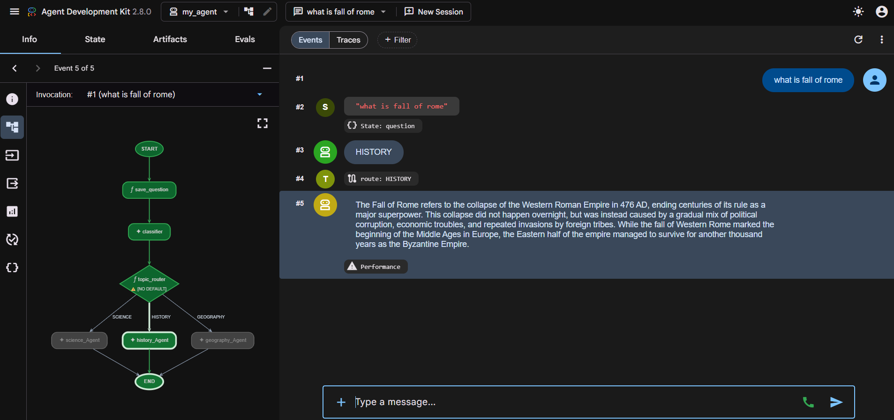
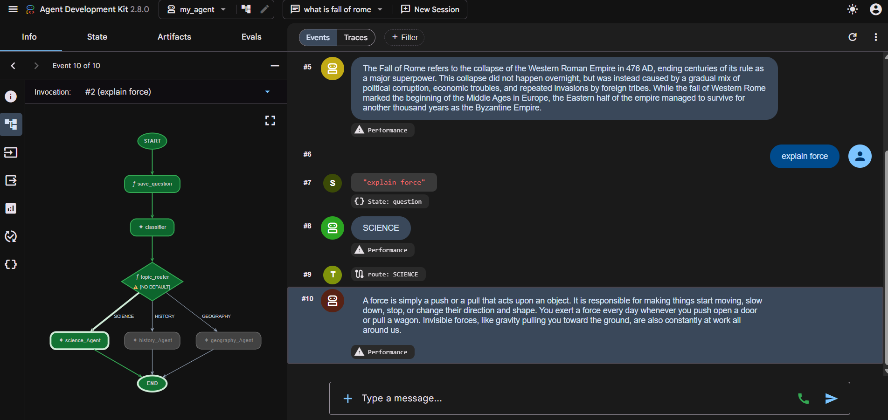
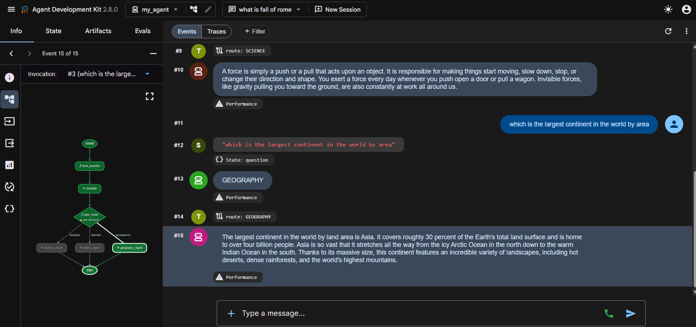

# Topic Routing Multi-Agent Workflow

A multi-agent AI workflow built using **Google Agent Development Kit (ADK)** that automatically classifies a user's question into **Science, History, or Geography** and routes it to the corresponding specialized agent.

The project demonstrates how multiple AI agents and deterministic workflow functions can be combined to create a structured **agentic workflow**.

---

## 🚀 Project Overview

This project implements a simple topic-based routing system using Google ADK.

Instead of sending every question to the same AI agent, the workflow first determines the topic of the question and then forwards it to a specialized agent.

## 🔄 Workflow

                   ┌────────────────┐
                   │     START      │
                   └───────┬────────┘                   
                           │
                           ▼
                    save_question
                           │
                           ▼
                      classifier
                           │
                           ▼
                     topic_router
          ┌─────────────────┼──────────────────┐
       SCIENCE           HISTORY           GEOGRAPHY
          │                 │                  │
          ▼                 ▼                  ▼
    science_Agent     history_Agent      geography_Agent
          └─────────────────┼──────────────────┘
                            ▼
                          END

## How it works

| Step | Component        | Purpose                                                         |
| ---- | ---------------- | --------------------------------------------------------------- |
| 1    | `save_question`  | Stores the original question in `state["question"]`             |
| 2    | `classifier`     | Classifies the question as `SCIENCE`, `HISTORY`, or `GEOGRAPHY` |
| 3    | `topic_router`   | Uses Python logic to select the appropriate agent               |
| 4    | Specialist Agent | Answers the original question                                   |

## 🧪 Execution Results

The workflow was tested successfully in the ADK Dev UI 2.8.0 with all three routes.

| Question                                | Classification | Routed Agent      |
| --------------------------------------- | -------------- | ----------------- |
| What is the Fall of Rome?               | `HISTORY`      | `history_Agent`   |
| Explain force                           | `SCIENCE`      | `science_Agent`   |
| Which is the largest continent by area? | `GEOGRAPHY`    | `geography_Agent` |

1. History Routing

Input: what is fall of rome

Events: the question is saved (State: question) → classifier returns HISTORY → route: HISTORY → history_Agent

2. Science Routing

Input: explain force

Events: State: question → SCIENCE → route: SCIENCE → science_Agent

3. Geography Routing

Input: which is the largest continent in the world by area

Events: State: question → GEOGRAPHY → route: GEOGRAPHY → geography_Agent

 ## Here's a Demo

## 🛠️ Technologies

Python
Google ADK
Gemini 
